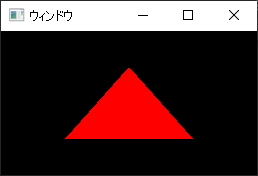

# eseed window

`namespace esd::wnd` | MIT License | 0.1.0 (Prerelease)



## Goal
A cross-platform, minimal, modern window library for C++17. Designed to support a variety of rendering APIs. Currently includes Vulkan surface management.

## A message from me
Hello everyone. This project is my second library, and began as a part of my game engine. If anyone is interested in contributing a different platform / new render API support, I'd love to work with you! In any case, I'll slowly be adding functionality myself, but it'll take plenty of research :) I hope someone will find this library useful!

**This project is currently in active development and some interface features may break at any time until this notice is removed**

## Known quirks / issues
#### X11
  - Shift key does not repeat like other keys
    - Repeat key presses may be disabled on all platforms, that's the purpose of the character callback
  - Print Screen and Meta keys do not seem to be detected
  - Button 4 & 5 currently not readable

## Features
- Current supported platforms
  - Win32
  - X11
- Current supported rendering APIs
  - Vulkan
- Input handling
  - Event polling and waiting
  - Keyboard
    - Key callback
      - Applicable key codes are mapped to their ASCII analogs
    - Char input callback (Unicode)
    - Key state getter
  - Mouse
    - Cursor position getter and setter
    - Cursor screen position getter and setter
    - Mouse button state getter
    - Mouse move callback
    - Mouse button callback
- Title management (Unicode)
- Size and position management
- Fullscreen

### Planned
- More platform support
  - Mac, Wayland, possibly others (contributions appreciated)
  - More Windows support
    - IME input
- More rendering API support
  - OpenGL context management
  - Possibly others
- More input handling
  - Mouse capturing
  - Controllers / gamepads
  - Additional (needs more research)
- More callbacks
  - Resize
  - Reposition
  - Window close
  - etc.
- Thread safety
- Sound? (possible)
- Anything else as it comes along :)

## Ghetto temporary documentation

### Building

ESeed Window uses CMake.

CMake Configuration Options:
- ESD_WND_BUILD_EXAMPLES *(ON, OFF | Default - OFF)*
- ESD_WND_ENABLE_VULKAN_SUPPORT *(ON, OFF | Default - OFF)*
  - Must be enabled to use Vulkan helper functions
- ESD_WND_PLATFORM *(Win32, X11 | Default - Auto Detect)*
  - This option may be manually set in order to specify a target platform for a different OS, otherwise the platform will be auto-detected
  - If no value is provided, Linux operating systems will default to X11, and Windows will default to Win32

#### Linking via a CMake subdirectory

If you are building your project with CMake as well, the library can easily be included in your project with `add_subdirectory(path/to/eseed-window)` and subsequently `target_link_libraries(target eseed_window)`.

### Basics
At the moment, the only supported rendering API is Vulkan. The library is currently implemented for Win32 and X11.

Windows are created with a simple constructor taking a title and size. This may be expanded with additional optional parameters in the future.

After the window has been created, events need to be checked periodically. This can be accomplished either with `.poll()` or `.waitEvents()`. Polling immediately processes 0 or more messages, and is useful for games and other applications that have a continuously updated event loop. However, GUI applications that don't need to be updated until input is received can simply wait until one or more new events are available, and let the CPU rest in the meantime.  

When the window class goes out of scope or is destroyed, the window itself will be freed and destroyed automatically.

The window can be closed early using `.close()`. When using Vulkan, the window must be closed after the surface, and before the instance. A window that has been closed cannot be used again unless it is reinitialized.

```cpp
#include <eseed/window/window.hpp>

int main() {
  
    // Window creation

    esd::wnd::Window window("Title", { 1366, 768 });

    // Event polling until window closes
    
    while (!window.isCloseRequested()) {
        window.waitEvents();
        // or: window.poll();
    }
}
```

### Input handling
Window input can be intercepted by setting the listeners in the window object.

#### Raw Keyboard Input
```cpp
window.keyHandler = [](esd::wnd::KeyEvent e) { ... };
```

Called when a key is pressed or released. `e` contains a key code and a boolean indicating whether it was pressed or released.

Individual key states can also be queried with `.isKeyDown(esd::wnd::Key)`.

Toggleable keys' toggle states (such as caps lock) can be queried with `.isKeyToggled(esd::wnd::Key)`.

Keys

#### Keyboard Char Input
```cpp
window.setKeyCharHandler([](esd::wnd::KeyCharEvent) { ... });
```

Called for each character generated by one or more keys.

`e` contains a `char32_t codePoint`, representing a Unicode code point.

#### Cursor Movement
```cpp
window.setCursorMoveHandler([](esd::wnd::CursorMoveEvent e) { ... });
```

Called while the cursor is actively moving. `e` contains the cursor's window coordinates, as well as screen coordinates. It also contains a boolean indicating whether the cursor has just entered the window.

Cursor position can be checked at any time using `.getCursorPos()` and `.getCursorScreenPos()`.

Cursor position can be set using `.setCursorPos(esd::wnd::CursorPos)` and `.setCursorScreenPos(esd::wnd::CursorPos)`.

#### Cursor Exiting Window
```cpp
window.setCursorExitHandler([](esd::wnd::CursorExitEvent e) { ... });
```

Called when the cursor exits the screen. `e` is an empty structure reserved for future use, and should be ignored for the moment.

Mouse reentry can be detected with cursor movement handler.

#### Mouse Button Input
```cpp
window.setMouseButtonHandler([](esd::wnd::MouseButtonEvent e) { ... });
```

Called when a mouse button is pressed or released. `e` contains a button code and boolean indicating whether it was pressed or released.

Individual mouse button states can be queried with `.isMouseButtonDown(esd::wnd::MouseButton)`

#### Scrolling
```cpp
window.scrollHandler = [](esd::wnd::ScrollEvent e) { ... };
```

Called when vertical or horizontal scroll is detected. `e` contains `vScroll` for vertical scroll and `hScroll` for horizontal scroll.

#### Window Resize
```cpp
window.resizeHandler = [](esd::wnd::ResizeEvent e) { ... };
```

Called when the window is resized. `e` contains the new window size.

#### Window Move
```cpp
window.moveHandler = [](esd::wnd::MoveEvent e) { ... };
```

Called when the window is moved. `e` contains the new window position.

### Vulkan support
The `esd::wnd::VulkanWindow` class is a helper class extending the base window class to provide platform-specific Vulkan functionality (surface creation). Both the C Vulkan library and C++ bindings (`vulkan.hpp`) are supported.

To use `VulkanWindow`, the CMake build files must be generated with `-DESD_WND_ENABLE_VULKAN_SUPPORT`.

Make sure to include the Vulkan header before `<esd/window/vulkanwindow.hpp>`.

`VulkanWindow` provides 3 additional functions:
- `std::vector<const char*> getRequiredSurfaceInstanceExtensions()`
- `VkSurface createSurface(const VkInstance& instance)`
- `vk::Surface createSurface(const vk::Instance& instance)` (only if `vulkan.hpp` is included)

```cpp
#include <vulkan/vulkan.hpp>
#include <eseed/window/vulkanwindow.hpp>

int main() {
    // Window creation
    esd::wnd::VulkanWindow window("Title" { 1366, 768 });
    
    // Get required instance extensions for surface creation
    std::vector<const char*> extensions = 
        window.getRequiredSurfaceInstanceExtensions();
    
    // Vulkan instance creation
    vk::InstanceCreateInfo instanceCreateInfo;
    ...
    instanceCreateInfo.setEnabledExtensionCount((uint32_t)extensions.size());
    instanceCreateInfo.setPpEnabledExtensions(extensions.data());
    ...
    vk::Instance instance = vk::createInstance(instanceCreateInfo);

    // Vulkan surface creation with eseed window
    vk::SurfaceKHR surface = window.createSurface(instance);

    ...

    while (!window.isCloseRequested()) {

        ...
      
        window.poll();
    }

    ...
    
    instance.destroySurfaceKHR(surface);

    // Important!
    // Close the window after destroying the surface but before destroying the
    // instance
    // Some platforms will give segmentation fault if this is performed out of order
    window.close();
    
    instance.destroy();
}
```

## Development notes

Semantic versioning is used.

All changes to the public API should be applied directly to the main branch, and never to individual platform dev branches. This minimizes merge conflicts by compartmentalizing changes for the public include headers, and each platform implementation.

Each platform in development should have its own development branch named `[platform]-dev`, e.g. `win32-dev`. It should refrain from modifying any non-platform-specific files, except when absolutely necessary such as for `CMakeLists.txt` or for very simple files like `.gitignore`.

TODO: add platform-specific CMake subdirectories to minimize modification of the main file.